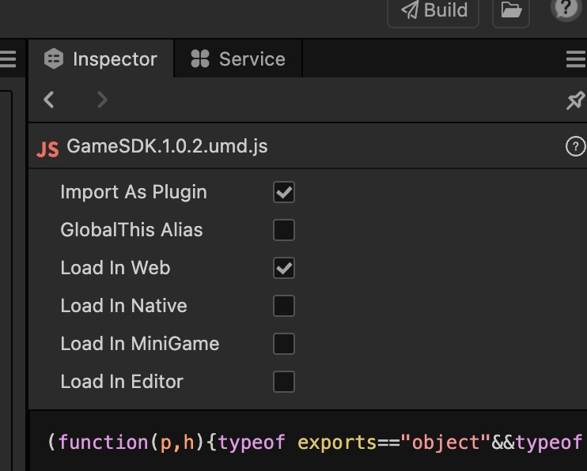

- [Introduction](#introduction)
- [Getting Started](#getting-started)
- [Download \& CDN](#download--cdn)
- [Web Integration](#web-integration)
- [Cocos Project Integration](#cocos-project-integration)
  - [Setup](#setup)
  - [Example Usage in Cocos Script](#example-usage-in-cocos-script)
- [API Reference](#api-reference)
  - [`GameSDK.init()`](#gamesdkinit)
  - [`GameSDK.login()`](#gamesdklogin)
  - [`GameSDK.showShareMenu()`](#gamesdkshowsharemenu)
  - [`GameSDK.saveImageInLocal()`](#gamesdksaveimageinlocal)
  - [`GameSDK.exit()`](#gamesdkexit)
  - [`GameSDK.requestMidasPayment()`](#gamesdkrequestmidaspayment)
- [Error Codes](#error-codes)

---

## Introduction

Open JSSDK provides a comprehensive interface to integrate JoyZap platform capabilities into your web or game projects. It supports user login, screen resizing, sharing, payments, and more.

---

## Getting Started

## Download & CDN

You can get the latest version of the SDK from:

- **GitHub Releases**  
  [https://github.com/JoyZapClub/JSSDK/releases/](https://github.com/JoyZapClub/JSSDK/releases/)

- **CDN**  
  Direct link to v1.0.4:  

  [https://developers.joyzap.io/sdk/JSSDK/1.0.4/GameSDK.1.0.4.umd.js](https://developers.joyzap.io/sdk/JSSDK/1.0.4/GameSDK.1.0.4.umd.js)


> We recommend using the CDN link for production to ensure faster and more stable delivery.


## Web Integration

Include the SDK script in your HTML and initialize it as shown below:

```html
<script src="./GameSDK.{version}.umd.js"></script>
<script>
  GameSDK.init({
    gameId: 'your_game_id',
    onSuccess: () => {
      console.log('GameSDK initialized successfully');

      document.getElementById('login').onclick = () => {
        GameSDK.login({
          success: (res) => console.log('Login successful:', res),
          fail: (error) => console.warn('Login failed:', error)
        });
      };

      // Portrait fullscreen
      document.getElementById('resizeScreen').onclick = () => {
        GameSDK.resizeScreen({
          fullScreen: 'show', // "hide" = exit fullscreen, "show" = enter fullscreen
          display: 1,         // 1 = portrait
          success: () => {},
          fail: (error) => {}
        });
      };

      // Landscape fullscreen
      document.getElementById('resizeScreenH').onclick = () => {
        GameSDK.resizeScreen({
          fullScreen: 'show',
          display: 2,         // 2 = landscape
          success: () => {},
          fail: (error) => {}
        });
      };

      // Exit
      document.getElementById('exit').onclick = () => {
        GameSDK.exit({
          success: () => {},
          fail: (error) => {}
        });
      };
    },
    onFail: (error) => {
      console.warn('GameSDK initialization failed:', error);
    }
  });
</script>
```

---

## Cocos Project Integration

### Setup

1. Copy `GameSDK.{version}.umd.js` into your Cocos project folder.  
2. Add it as a plugin in the Cocos Creator editor, enabling web loading.



### Example Usage in Cocos Script

```ts
import { _decorator, Component, Button, EventHandler, EditBox, Event, log, view } from 'cc';
const { ccclass, property } = _decorator;

declare global {
  interface Window {
    GameSDK: any;
  }
}

@ccclass('GameUI')
export class GameUI extends Component {
  @property([Button]) buttons: Button[] = [];
  @property([String]) eventNames: string[] = [];
  @property(EditBox) gameIdInput: EditBox = null;

  onLoad() {
    view.enableAutoFullScreen(false);
    this.bindButtons();
  }

  bindButtons() {
    this.buttons.forEach((button, index) => {
      const eventName = this.eventNames[index];
      const clickEventHandler = new EventHandler();
      clickEventHandler.target = this.node;
      clickEventHandler.component = 'GameUI';
      clickEventHandler.handler = 'onClickButton';
      clickEventHandler.customEventData = eventName;
      button.clickEvents = [clickEventHandler];
    });
  }

  onClickButton(event: Event, customEventData: string) {
    log(`Button clicked: ${customEventData}`);
    const gameId = this.gameIdInput?.string || 'Not entered';

    switch (customEventData) {
      case 'init':
        window.GameSDK.init({
          gameId,
          onSuccess: () => log('GameSDK initialized successfully'),
          onFail: (error) => console.warn('GameSDK initialization failed:', error)
        });
        break;
      case 'login':
        window.GameSDK.login({
          success: (res) => log('Login successful:', res),
          fail: (error) => console.warn('Login failed:', error)
        });
        break;
      case 'share':
        // Implement share functionality here
        break;
      case 'hengping':
        window.GameSDK.resizeScreen({
          fullScreen: 'show',
          display: 2,
          success: () => log('Screen resized successfully (landscape)'),
          fail: (error) => console.warn('Screen resize failed:', error)
        });
        break;
      case 'shuping':
        window.GameSDK.resizeScreen({
          fullScreen: 'show',
          display: 1,
          success: () => log('Screen resized successfully (portrait)'),
          fail: (error) => console.warn('Screen resize failed:', error)
        });
        break;
      case 'exit':
        window.GameSDK.exit({
          success: () => log('Exited WebView successfully'),
          fail: (error) => console.warn('Exit WebView failed:', error)
        });
        break;
      default:
        log(`Unknown button action: ${customEventData}`);
    }
  }
}
```

---

## API Reference

### `GameSDK.init()`

Initializes the SDK. **Must be called before any other API calls.**

- **Parameters**:

  | Name       | Type     | Required | Description                            |
  | ---------- | -------- | -------- | ------------------------------------ |
  | `gameId`   | String   | Yes      | Unique game identifier                |
  | `onSuccess`| Function | Yes      | Callback invoked on successful init  |
  | `onFail`   | Function | Optional | Callback invoked on init failure     |

---

### `GameSDK.login()`

Obtains a temporary authorization code to retrieve user information.

- **Parameters**:

  | Name      | Type     | Required | Description                                |
  | --------- | -------- | -------- | ------------------------------------------ |
  | `success` | Function | Optional | Callback on successful login, receives response object |
  | `fail`    | Function | Optional | Callback on login failure, receives error information   |

- **Example**:

  ```js
  GameSDK.login({
    success: (res) => console.log(res),
    fail: (err) => console.error(err)
  });
  ```

---

### `GameSDK.showShareMenu()`

Registers a callback to provide share data when user triggers menu share.

- **Parameters**:

  | Name     | Type     | Required | Description                          |
  | -------- | -------- | -------- | ---------------------------------- |
  | Callback | Function | Yes      | Function returning share details object |

- **Share Details Object**:

  | Property | Type     | Description                       |
  | -------- | -------- | -------------------------------- |
  | `title`  | String   | Share title                      |
  | `desc`   | String   | Share description (optional)     |
  | `icon`   | String   | Share icon URL (optional)        |
  | `imgUrls`| String[] | Array of image URLs for sharing  |

- **Example**:

  ```js
  GameSDK.showShareMenu(() => ({
    title: 'Share Title',
    desc: 'Share Description',
    icon: 'Share Icon',
    imgUrls: ['url1', 'url2']
  }));
  ```

---

### `GameSDK.saveImageInLocal()`

Saves an image to the device's local album.

- **Parameters**:

  | Name      | Type     | Required | Description                            |
  | --------- | -------- | -------- | ------------------------------------ |
  | `image`   | String   | Yes      | Image URL or base64 string            |
  | `type`    | String   | Optional | `'1'` for image URL, `'2'` for base64 string |
  | `success` | Function | Optional | Callback on successful save          |
  | `fail`    | Function | Optional | Callback on failure                   |

- **Example**:

  ```js
  GameSDK.saveImageInLocal({
    image: 'https://example.com/image.png',
    type: '1',
    success: () => console.log('Image saved'),
    fail: () => console.error('Save failed')
  });
  ```

---

### `GameSDK.exit()`

Exits the current WebView context.

- **Example**:

  ```js
  GameSDK.exit();
  ```

---

### `GameSDK.requestMidasPayment()`

Initiates an in-app purchase.

- **Parameters**:

  | Name      | Type     | Required | Description                     |
  | --------- | -------- | -------- | ------------------------------- |
  | `success` | Function | Optional | Callback on payment success     |
  | `fail`    | Function | Optional | Callback on payment failure     |

- **Example**:

  ```js
  GameSDK.requestMidasPayment({
    success: (res) => console.log(res),
    fail: (err) => console.error(err)
  });
  ```

---

## Error Codes

| Code  | Description                          |
|-------|------------------------------------|
| 0     | Success                            |
| 1001  | Not inside Joyzap App              |
| 1002  | Failed to obtain authorization code |
| 1003  | Failed to load image resource      |
| 500   | System error                      |
